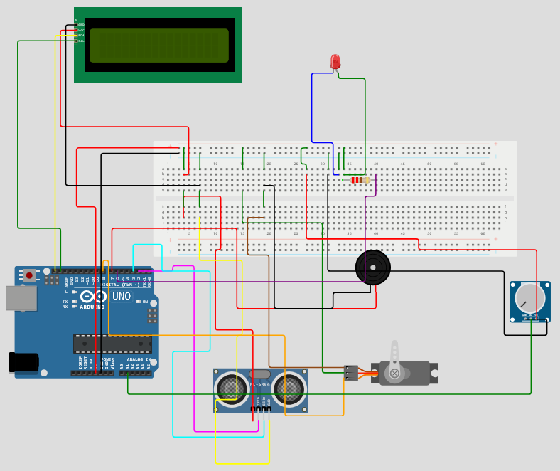
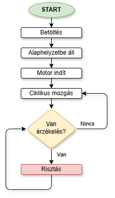

# Arduino alapú szónikus radar
A projekt céla, hogy egy mikrokontrollerrel vezérelt önműködő rendszert hozzunk létre, amiben valamilyen bemenet változás hatására automatikus beavatkozás történjen.
A mi esetünkben egy ultrahangos távolságérzékelő figyeli 180°-ban a területet, s ha egy megadott távolságon belül tereptárgyat érzékel, akkor hangjelzést ad és kiírást tesz a kijelzőre; ezzel értesítve a tulajdonost.

[](pics/project.png)

---
## Tartalom
<!-- TOC -->
- [Arduino alapú szónikus radar](#arduino-alapú-szónikus-radar)
  - [Tartalom](#tartalom)
  - [Feladat](#feladat)
    - [Követelmények](#követelmények)
  - [Megvalósítás](#megvalósítás)
    - [Szimulációs környezet](#szimulációs-környezet)
    - [Fizikai eszközök](#fizikai-eszközök)
      - [Áramellátás](#áramellátás)
      - [I^2^C LCD (kijelző)](#i2c-lcd-kijelző)
      - [Micro Servo (SG90 / MG996)](#micro-servo-sg90--mg996)
      - [Ultrasonic Sensor (HC-SR04)](#ultrasonic-sensor-hc-sr04)
      - [Active buzzer](#active-buzzer)
      - [LED (állapotjelző)](#led-állapotjelző)
    - [Programozás](#programozás)
      - [A kód](#a-kód)
      - [A működés rövid leírása](#a-működés-rövid-leírása)
      - [A működés folyamatábrája](#a-működés-folyamatábrája)
<!-- TOC -->

## Feladat
A _**Nyíregyházi Egyetem - [BMI1504L] - IoT alapok** (2025. őszi félév)_ elnevezésű tantárgy követelményekényt megfogalmazott automatizált rendszer megvalósítása.
A projekt megvalósítói:
- Kátai Attila
- Suller György
- Oláh Zsolt

### Követelmények
A projekt feladatnak mindenképpen tartalmaznia kell:
- egy mikrokontrollert,
- egy érzékelőt,
- egy kijelzőt,
- egy beavatkozót (aktuátort),
- egy futtatható kódot,
- egy github oldalt, ahol az eredmények elérhetők,
- dokumentációt.

## Megvalósítás

### Szimulációs környezet
A projekt megvalósításához felhasználtunk a [WOKWI szimulációs oldal](https://wokwi.com) inygenes felületét, ahol különböző mikrokontrollert és egyéb, hozzá kapcsolható eszközt, programkönyvtárat egybe tudtunk rendezni még azelőtt, mielőtt a fizikai eszközöket megvásároltuk volna.
Ennek előnye, hogy nagyon sok mindent le tudtunk tesztelni előre, s így ki tudtuk választani a projekt megvalósításához szükséges eszközöket.
A szimulációt az alábbi oldalon lehet elérni: [link](https://wokwi.com/projects/449230802610289665)

### Fizikai eszközök
A projekt kivitelezéséhez a következő eszközök kerültek beszerzésre:
 - [x] [Arduino Uno R3](pics/arduino.png)
 - [x] [Potenciométer (10k)](pics/potmeter.png)
 - [x] [Micro Servo (SG90)](pics/servo.png)
 - [x] [I^2^C LCD (16x2)](pics/lcd.png)
 - [x] [Ultrasonic Sensor (HC-SR04)](pics/sensor.png)
 - [x] [Active buzzer](pics/buzzer.png)
 - [x] [LED (piros)](pics/led.png)
 - [x] [Ellenállás (220-330 Ohm)](pics/ellenallas.png)
 - [x] [Breadboard](pics/breadboard.png)
 - [x] [Kábelezés](pics/cords.png)

#### Áramellátás
Központi áram elosztó elem a Breadbord, ahová az Arduino kimeneti lábait kötöttük, s minden csatlakoztatott eszköz innen vételezheti a működéséhez szükséges tápellátást.
- Arduino **5V** kimenet: **+** (breadbord pozitív sín)
- Arduino **GND** kimenet: **-** (breadbord negatív sín)

#### I^2^C LCD (kijelző)
- **VCC**: Breadboard +5V (pozitív)
- **GND**: Breadboard GND (negatív)
- **SDA**: Arduino SDA (A4)
- **SCL**: Arduino SCL (A5)

#### Micro Servo (SG90 / MG996)
- **Piros**: Breadboard +5V (pozitív)
- **Barna/Fekete**: Breadboard GND (negatív)
- **Narancs/Fehér**: Arduino **D8** digitális pin

#### Ultrasonic Sensor (HC-SR04)
- **VCC**: Breadboard +5V (pozitív)
- **GND**: Breadboard GND (negatív)
- **Trigger**: Arduino **D2** pin
- **Echo**: Arduino **D3** pin

#### Active buzzer
- **Pozitív (+)**: Arduino **D7** pin
- **Negatív (–)**: Breadboard GND (negatív)

#### LED (állapotjelző)
- **Anód (+)**: Arduino **D6** pin
- **Katód (–)**: Breadboardra kötve → sorosan az ellenállással → GND

### Programozás
A projekt szoftveres kivitelezéséhez az Arduino IDE szolgált, ami ingyenesen letölthető, s a mindenkor szükséges, a mikrokontrollernek és kapcsolt eszközeiknek megfelelő függvénykönyvtárakkal bővíthető.
- Arduino IDE: [letöltés](https://docs.arduino.cc/software/ide-v2/tutorials/getting-started/ide-v2-downloading-and-installing/)
- LiquidCrystal I2C forráskönyvtár: [letöltés](https://www.arduinolibraries.info/libraries/liquid-crystal-i2-c)
- Micro servo forráskönyvtár: [letöltés](https://www.arduinolibraries.info/libraries/servo)

#### A kód
A futtatható kód, ami a működést biztosítja:

```c
#include <Wire.h>
#include <LiquidCrystal_I2C.h>
#include <Servo.h>

LiquidCrystal_I2C lcd(0x3F, 16, 2);
Servo radarServo;

const int trigPin = 2;
const int echoPin = 3;
const int ledPin = 6;
const int buzzerPin = 7;
const int servoPin = 8;

const int potPin = A1;  

float ido, tav;

int fok = 0;
int lepes = 2;

void setup() {
  Serial.begin(9600);

  pinMode(trigPin, OUTPUT);
  pinMode(echoPin, INPUT);
  pinMode(ledPin, OUTPUT);
  pinMode(buzzerPin, OUTPUT);

  radarServo.attach(servoPin);

  lcd.init();
  lcd.backlight();
  lcd.clear();

  lcd.setCursor(0, 0);
  lcd.print("Radar indul...");
  delay(1000);
}

float measureDistance() {
  digitalWrite(trigPin, LOW);
  delayMicroseconds(2);
  digitalWrite(trigPin, HIGH);
  delayMicroseconds(10);
  digitalWrite(trigPin, LOW);

  ido = pulseIn(echoPin, HIGH);
  tav = (ido * 0.0343) / 2;

  //Serial.print("Tavolsag: ");
  //Serial.println(tav);

  return tav;
}

void loop() {

  // --- POTMÉTER BEOLVASÁSA ---
  int potValue = analogRead(potPin);

  // A pásztázás sebessége (10–120 ms között)
  int sweepDelay = map(potValue, 0, 1023, 10, 120);

  radarServo.write(fok);

  tav = measureDistance();

  Serial.print("Szog: ");
  Serial.print(fok);
  Serial.print("  Tav: ");
  Serial.print(tav);
  Serial.print(" cm  Speed: ");
  Serial.println(sweepDelay);

  lcd.clear();

  // ********** KÉRT KIÍRÁS: SZÖG + SEBESSÉG EGY SORBAN **********
  lcd.setCursor(0, 0);
  lcd.print("Szog:");
  lcd.print(fok);
  lcd.print(" SPD:");
  lcd.print(sweepDelay);
  // **************************************************************

  lcd.setCursor(0, 1);

  if (tav <= 50 && tav > 0) {
    digitalWrite(ledPin, HIGH);
    digitalWrite(buzzerPin, HIGH);
    lcd.print("Behatolas!");
  } else {
    digitalWrite(ledPin, LOW);
    digitalWrite(buzzerPin, LOW);
    lcd.print("Tav: ");
    lcd.print(tav, 1);
    lcd.print(" cm");
  }

  // Szervó irányváltás
  fok += lepes;
  if (fok >= 180 || fok <= 0) lepes = -lepes;

  // *** EZT SZABÁLYOZZA A POTMÉTER ***
  delay(sweepDelay);
}
```

#### A működés rövid leírása
A szervo motor 180°-ban mozgatja oda-vissza az ultrahangos távolság érzékelőt, ami folyamatosan "figyel". Ha hatótávolságon belül valamilyen tereptárgyat érzékel, akkor ez beindítja a riasztást. Ekkor a buzzer megszólal, s a kijelzőre kiírja a számított távolságot.

#### A működés folyamatábrája
